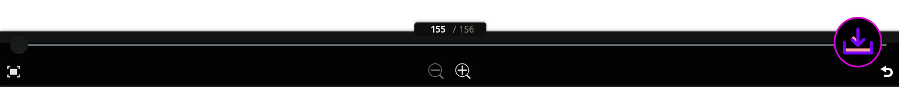

# clip-studio-reader-downloader
Tampermonkey userscript to download books as zip files from the browser version of Clip Studio Reader, the most popular e-book reader for manga and other Japanese media.

## Install this script

You must have a userscript browser extension installed (any will do):
- [GreaseMonkey](https://www.greasespot.net/)
- [Tampermonkey](http://tampermonkey.net/)
- [Violentmonkey](https://violentmonkey.github.io/)
  
Once that is done, simply...
- [Install from GreasyFork](https://greasyfork.org/en/scripts/481576-clip-studio-reader-downloader)

## How to Use
1. Open a book in Clip Studio Reader. The current supported sites are listed below, make sure the page open with the book you are downloading is on one of them.
2. Click the snazzy-looking purple download button.
3. Sit back, each 100 pages can take approximately 1 minute to download if the downloader needs to render/unscramble every page individually
4. Save your book, now as a zip file
   

## Site Support

As mentioned, each site's integrated Clip Studio Reader is a little different. A user-driven support package submission system is under development, but until then explicit support for each site is necessary. The current supported sites are:

| Reader site | Bookstore |
|-|-|
|https://api.distribution.mediadotech.com/|[Pixiv Comics](https://comic.pixiv.net/)|
|https://mbj-bs.pf.mobilebook.jp/| [honto](https://honto.jp/)|
|https://comic-viewer.iowl.jp/|[ComicFesta](https://comic.iowl.jp/)|
|https://comic.pixiv.net/viewer/| [Pixiv Comics](https://comic.pixiv.net/)|

If you want another site to be supported, feel free to open an issue here with the bookstore, reader site (where you actually read the book), and any other helpful details you can think of. Of course, if you have the techinical inclination, I am accepting PRs for site support too.

## Mechanism
This userscript extracts rendered canvases from the book reader, packages them into a zip file with [JSZip](https://github.com/Stuk/jszip), and presents the zip file to you with [FileSaver.js](https://github.com/eligrey/FileSaver.js).

## Something Went Wrong?
Simple errors that you can fix quickly will appear next to the download button, just follow the instructions and you can get back to downloading!

If the issue is more fatal, this userscript logs to the javascript console (Developer Tools) with lines beginning with `[CSRD]:`. Take a look there to see if anything immediately obvious happened, otherwise feel free to open an issue here with the relevant log details!

Note that many Clip Studio Reader pages restrict opening the console with keyboard shortcuts. In these cases, it may be necessary to press the Alt key on your keyboard to open the window menu and find the Developer Tools there. This will be different for each browser, but on Firefox you can go to `Tools -> Browser Tools -> Web Developer Tools`.

### Memory Usage
This userscript holds the entire zip file in memory. While this should typically not present any problems, exceptionally large books (4GB+, or over 2000 pages) and low system memory may result in `Out Of Memory` Errors. Please open an issue and tell me if you ever see this happening!

This userscript was developed and tested on [Firefox](https://www.mozilla.org/en-US/firefox/new/).
